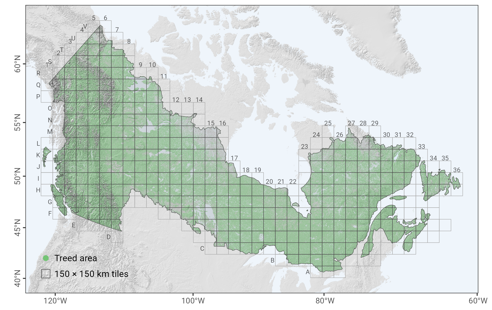

---
output:
  github_document:
    md_extensions: +tex_math_dollars+tex_math_single_backslash
always_allow_html: true
---
  
## Remote Sensing-based Yield Curves (RSYC) for Canada's Forested Ecozones

```{r, warning=F, message=F, echo=F}
knitr::opts_chunk$set(
  fig.path = "man/figures/README-",
  dev = "png"
)
knitr::opts_knit$set(escape = FALSE)
```


The RSYC models provide estimates of aboveground biomass (AGB) accumulation over stand age across all forested ecozones of Canada. Developed using Landsat time-series data for forest age, species composition, and AGB, the models include 27 species-specific yield curves as well as three multi-species models (coniferous, broadleaf, and generic). Each model represents the average AGB trajectory (in t/ha) within a 150 × 150 km tile, capturing large-scale spatial variability in productivity and environmental conditions.

[](man/figures/RSYC_curves_species_gh.png)


RSYC models were developed to support large-area assessments of forest growth and carbon dynamics using a consistent, nationally harmonized approach. Validation was conducted using an independent set of field plots, and model development emphasized both empirical accuracy and biological realism. Compared to traditional growth and yield models, RSYC provides improved spatial coverage, a consistent methodological framework across jurisdictions, and lower systematic bias, making them particularly suitable for applications such as national carbon accounting and forest resource planning.

For more details on model development, validation, and applications, please refer to Tompalski et al. 2025. For more details on data pre-processing, filtering approach, and initial model development see [Tompalski et al. 2024](https://linkinghub.elsevier.com/retrieve/pii/S0378112724002068) (open access).


## Model availability

The RSYC models are both species-specific and tile-specific, meaning each combination of species and geographic tile may have its own yield curve. A full index of available species–tile combinations is included in the package and can be accessed programmatically. Additionally, the spatial distribution of tiles with available models is shown in the figure below.



## Model parameters

You don't need to install the R package to use the model. All model parameters used in RSYC are available for direct download:

- **Model parameters:** [RSYC_params.csv](https://raw.githubusercontent.com/ptompalski/RSYC/main/data-raw/RSYC_params.csv) 

- **Tile grid:** [`RSYC_tiles.gpkg`](https://raw.githubusercontent.com/ptompalski/RSYC/main/inst/extdata/RSYC_tiles.gpkg)


The RSYC model predicts above-ground biomass (AGB) as a function of stand age:

```{r, results='asis', echo=FALSE}
cat("$$
AGB = b_1 e^{-b_4 \\text{Age}} (1 - e^{-b_2 \\text{Age}})^{b_3}
$$")
```


where

- $b_1, b_2, b_3, b_4$ are tile- and species-specific parameters
- *Age* is stand age (years)


## Installation

```r
# Install from GitHub
# install.packages("remotes")
remotes::install_github("ptompalski/RSYC")
```


## Examples

Predict AGB for black spruce at different ages in tile H14
```{r}
library(RSYC)

predict_rsyc(tile_id = "H14", age = c(20, 60, 120), species = "PICE.MAR")
```

Predict AGB for coniferous species in tiles 
```{r, warning=F, message=F, fig.width=10, fig.height=5, dev="svg", fig.cap=""}
library(tidyverse)

yc <- tibble(tile = c("N3", "H17", "F31")) %>%
  mutate(
    age = list(1:150),
    agb = map2(tile, age, ~ predict_rsyc(tile_id = .x, age = .y, species = "Coniferous"))
  ) %>%
  unnest(c(age, agb))

ggplot(yc, aes(x = age, y = agb, color = tile)) +
  geom_line() +
  labs(
    x = "Stand Age (years)",
    y = "Aboveground Biomass (t/ha)",
    color = "Tile",
    title = "RSYC Biomass Predictions by Tile"
  ) +
  theme_minimal(base_size = 14)

```


## References
If you use this package in your work, please cite:

Tompalski, P., Hermosilla, T., Baral, S.K., Wulder, M.A., White, J.C. 2025. National remote sensing-derived aboveground biomass yield curves for Canada. Forestry: An International Journal Of Forest Research. https://doi.org/10.1093/forestry/cpaf067


Tompalski, P., Wulder, M.A., White, J.C., Hermosilla, T., Riofrío, J., Kurz, W.A., 2024. Developing aboveground biomass yield curves for dominant boreal tree species from time series remote sensing data. Forest Ecology and Management 561, 121894. https://doi.org/10.1016/j.foreco.2024.121894
