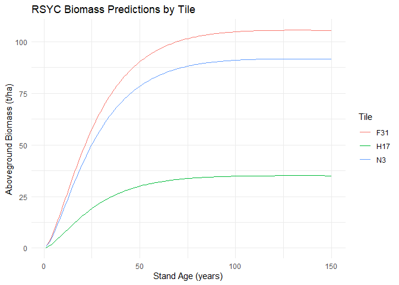

## Remote Sensing-based Yield Curves (RSYC) for Canada’s Forested Ecozones

The RSYC models provide estimates of aboveground biomass (AGB)
accumulation over stand age across all forested ecozones of Canada.
Developed using Landsat time-series data for forest age, species
composition, and AGB, the models include 27 species-specific yield
curves as well as three multi-species models (coniferous, broadleaf, and
generic). Each model represents the average AGB trajectory (in t/ha)
within a 150 × 150 km tile, capturing large-scale spatial variability in
productivity and environmental conditions.

[](man/figures/RSYC_curves_species.png)

RSYC models were developed to support large-area assessments of forest
growth and carbon dynamics using a consistent, nationally harmonized
approach. Validation was conducted using an independent set of field
plots, and model development emphasized both empirical accuracy and
biological realism. Compared to traditional growth and yield models,
RSYC provides improved spatial coverage, a consistent methodological
framework across jurisdictions, and lower systematic bias, making them
particularly suitable for applications such as national carbon
accounting and forest resource planning.

For more details on model development, validation, and applications,
please refer to Tompalski et al. 2025. For more details on data
pre-processing, filtering approach, and initial model development see
[Tompalski et
al. 2024](https://linkinghub.elsevier.com/retrieve/pii/S0378112724002068)
(open access).

## Installation

``` r
# Install from GitHub
# install.packages("remotes")
remotes::install_github("ptompalski/RSYC")
```

## Model availability

The RSYC models are both species-specific and tile-specific, meaning
each combination of species and geographic tile may have its own yield
curve. A full index of available species–tile combinations is included
in the package and can be accessed programmatically. Additionally, the
spatial distribution of tiles with available models is shown in the
figure below.


## Examples

Predict AGB for black spruce at different ages in tile H14

``` r
library(RSYC)

predict_rsyc(tile_id = "H14", age = c(20, 60, 120), species = "PICE.MAR")
```

    ## [1] 33.00630 65.95080 78.23435

Predict AGB for coniferous species in tiles

``` r
library(tidyverse)

yc <- tibble(tile = c("N3", "H17", "F31")) %>%
  mutate(
    age = list(1:150),
    agb = map2(tile, age, ~ predict_rsyc(tile_id = .x, age = .y, species = "Coniferous"))
  ) %>%
  unnest(c(age, agb))

ggplot(yc, aes(x = age, y = agb, color = tile)) +
  geom_line() +
  labs(
    x = "Stand Age (years)",
    y = "Aboveground Biomass (t/ha)",
    color = "Tile",
    title = "RSYC Biomass Predictions by Tile"
  ) +
  theme_minimal()
```

<!-- -->

## References

If you use this package in your work, please cite:

Tompalski, P., Hermosilla, T., Baral, S., Wulder, M.A., White, J.C.,
(2025). National aboveground biomass yield curves for Canada . In prep.

Tompalski, P., Wulder, M.A., White, J.C., Hermosilla, T., Riofrío, J.,
Kurz, W.A., 2024. Developing aboveground biomass yield curves for
dominant boreal tree species from time series remote sensing data.
Forest Ecology and Management 561, 121894.
<https://doi.org/10.1016/j.foreco.2024.121894>
