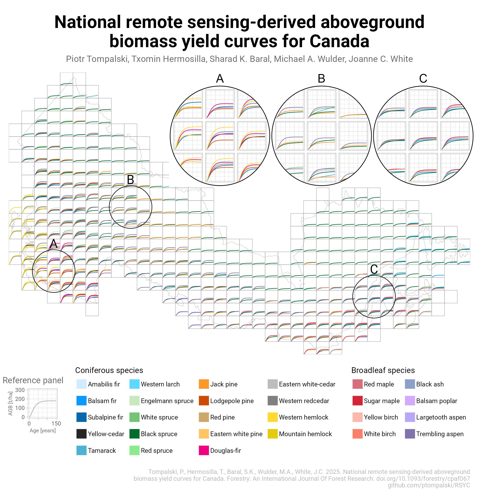
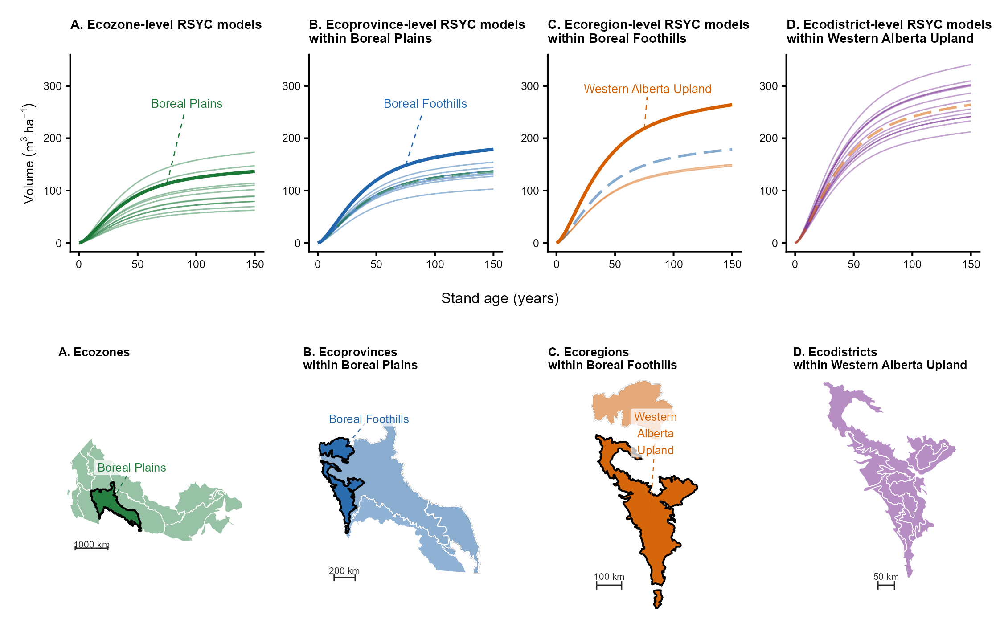
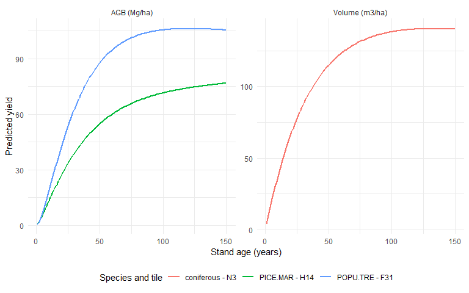

# RSYC: Remote Sensing-Based Yield Curves for Canada

RSYC provides published yield curves for aboveground biomass (AGB,
Mg/ha) and total volume (m3/ha). Curves are available for individual
species and the `generic`, `coniferous`, and `broadleaf` model groups.

Models are available for 150 x 150 km tiles and four nested ecological
levels: ecozone, ecoprovince, ecoregion, and ecodistrict.

<figure>

<figcaption aria-hidden="true">Species-specific RSYC curves across
Canada’s 150 km tile grid.</figcaption>
</figure>

## Model parameters

You don’t need to install the R package to use the models. All model
parameters used in RSYC are available for direct download. The ZIP
archive contains the updated `RSYC_models.csv` table, including AGB and
volume models for tiles and ecological strata.

- **Model parameters:**
  [RSYC_models.zip](https://raw.githubusercontent.com/ptompalski/RSYC/main/data-raw/RSYC_models.zip)

- **Tile grid:**
  [RSYC_tiles.gpkg](https://raw.githubusercontent.com/ptompalski/RSYC/main/inst/extdata/RSYC_tiles.gpkg)

- **Ecological strata:**
  [RSYC_ecostrat.gpkg](https://github.com/ptompalski/RSYC/releases/download/boundaries-v1/RSYC_ecostrat.gpkg)

The RSYC models predict aboveground biomass (AGB) or total volume as a
function of stand age:

$$
y = b_1 e^{-b_4 \mathrm{Age}} (1 - e^{-b_2 \mathrm{Age}})^{b_3}.
$$

where

- $y$ is AGB (Mg/ha) or total volume (m3/ha)
- $b_1, b_2, b_3, b_4$ are response-, stratum-, and species-specific
  parameters
- *Age* is stand age (years)

The curves were fitted for stand ages 1 to 150 years. RSYC warns when
asked to estimate outside this age range. Age 0 is also allowed as the
starting point of a curve.

## Installation

``` r
# install.packages("remotes")
remotes::install_github("ptompalski/RSYC")
```

## Examples

### Estimate biomass or volume

Estimate AGB for black spruce (`PICE.MAR`) in tile H14 at stand ages 20,
60, and 120 years:

``` r
library(RSYC)
predict_rsyc("agb", "PICE.MAR", c(20, 60, 120), "tile", "H14")
#> [1] 27.49419 60.21335 74.19827
```

To estimate total volume instead, set `response = "volume"`:

``` r
predict_rsyc(
  response = "volume",
  species = "PICE.MAR",
  age = c(20, 60, 120),
  strata_level = "tile",
  strata_id = "H14"
)
```

For ecological areas, the area name is enough when it occurs only once
at the chosen level:

``` r
predict_rsyc(
  response = "agb",
  species = "PICE.MAR",
  age = c(20, 60, 120),
  strata_level = "ecodistrict",
  strata_id = "Windsor Lowlands"
)
```

Some area names occur in more than one part of Canada. In those cases,
`predict_rsyc()` lists every match. Choose the intended area using the
full sequence of ecological areas shown by `rsyc_strata()`.

#### Compare species and tiles

The following example estimates AGB and volume for several species,
stand ages, and tiles. Each row of `tile_inputs` describes one estimate.
All combinations shown below have a published RSYC curve.

``` r
tile_inputs <- tidyr::crossing(
  response = c("agb", "volume"),
  species = c("PICE.MAR", "POPU.TRE", "coniferous"),
  age = c(20, 60, 120),
  strata_level = "tile",
  strata_id = c("H14", "F31")
) |>
  dplyr::mutate(
    prediction = purrr::pmap_dbl(
      list(response, species, age, strata_level, strata_id),
      predict_rsyc
    )
  )

tile_inputs
```

#### Compare ecological levels

Use the area name at the chosen ecological level when that name occurs
only once.

``` r
eco_inputs <- tibble::tribble(
  ~response, ~species,   ~age, ~strata_level, ~strata_id,
  "agb",     "PICE.MAR", 80,  "ecozone",
    "Atlantic Maritime",
  "agb",     "PICE.MAR", 80,  "ecoprovince",
    "Appalachian-Acadian Highlands",
  "agb",     "PICE.MAR", 80,  "ecoregion",
    "Appalachians",
  "agb",     "PICE.MAR", 80,  "ecodistrict",
    "Windsor Lowlands"
)

eco_inputs <- eco_inputs |>
  dplyr::mutate(
    prediction = purrr::pmap_dbl(
      list(response, species, age, strata_level, strata_id),
      predict_rsyc
    )
  )

eco_inputs
```

The same species can have different curves at each nested ecological
level. The example below shows black spruce volume curves together with
the areas they represent:

<figure>

<figcaption aria-hidden="true">Black spruce volume curves and maps at
four nested ecological levels.</figcaption>
</figure>

If a name occurs in several places, list the alternatives and use the
full sequence from ecozone to the selected level:

``` r
rsyc_strata("agb", "PICE.MAR", "ecodistrict") |>
  dplyr::filter(strata_name == "Muskwa")

predict_rsyc(
  "agb", "PICE.MAR", 80, "ecodistrict",
  "Boreal Cordillera/Hay-Slave Lowlands/Muskwa Plateau/Muskwa"
)
```

#### Generate several complete curves

The following example produces a complete set of estimates for ages 1 to
150 for each species and area listed in `curve_inputs`:

``` r
curve_inputs <- tibble::tribble(
  ~response, ~species,    ~strata_level, ~strata_id,
  "agb",     "PICE.MAR",  "tile",       "H14",
  "agb",     "POPU.TRE",  "tile",       "F31",
  "volume",  "coniferous", "tile",       "N3"
)
curve_inputs <- curve_inputs |>
  dplyr::mutate(
    age = list(1:150),
    prediction = purrr::pmap(
      list(response, species, age, strata_level, strata_id),
      predict_rsyc
    )
  )

curve_inputs
#> # A tibble: 3 × 6
#>   response species    strata_level strata_id age         prediction 
#>   <chr>    <chr>      <chr>        <chr>     <list>      <list>     
#> 1 agb      PICE.MAR   tile         H14       <int [150]> <dbl [150]>
#> 2 agb      POPU.TRE   tile         F31       <int [150]> <dbl [150]>
#> 3 volume   coniferous tile         N3        <int [150]> <dbl [150]>

curve_predictions <- curve_inputs |>
  tidyr::unnest(c(age, prediction))
```

Plot the curves to compare how predicted yield changes with stand age.
AGB and volume are shown separately because they use different units:

``` r
curve_predictions |>
  dplyr::mutate(
    response = factor(
      response,
      levels = c("agb", "volume"),
      labels = c("AGB (Mg/ha)", "Volume (m3/ha)")
    ),
    curve = paste(species, strata_id, sep = " - ")
  ) |>
  ggplot2::ggplot(ggplot2::aes(age, prediction, colour = curve)) +
  ggplot2::geom_line(linewidth = 0.9) +
  ggplot2::facet_wrap(ggplot2::vars(response), scales = "free_y") +
  ggplot2::labs(
    x = "Stand age (years)",
    y = "Predicted yield",
    colour = "Species and tile"
  ) +
  ggplot2::theme_minimal() +
  ggplot2::theme(legend.position = "bottom")
```



See [Prediction examples](vignettes/articles/Prediction-examples.Rmd)
for a longer walkthrough, including model-availability checks.

### Find available curves

Three functions are provided to help identify which model to use:

- `available_rsyc_models()` lists individual published curves that match
  a response, species, type of area, or area name. For example, list the
  volume curves for black spruce at the ecozone level:

``` r
available_rsyc_models(
  response = "volume",
  species = "PICE.MAR",
  strata_level = "ecozone"
)
```

- `rsyc_species()` lists the species available for a selected response
  and area. It also gives each species’ common name and model group. For
  example, list the AGB species available in tile H14:

``` r
rsyc_species(response = "agb", strata_level = "tile", strata_id = "H14")
```

- `rsyc_strata()` lists the areas for which models are available for a
  selected response and species. It gives both the short area name and
  the full hierarchical area identifier, which can distinguish repeated
  area names. For example, list the ecozones with volume models for
  black spruce:

``` r
rsyc_strata(
  response = "volume",
  species = "PICE.MAR",
  strata_level = "ecozone"
)
```

### Create spatial yield-curve datasets

`rsyc_product()` prepares yield estimates and the matching area
boundaries. The boundaries are stored separately so the same map shape
is not repeated for every species and stand age. By default, the
function estimates ages 1 through 150:

``` r
product <- rsyc_product(
  response = "volume",
  species = c("PICE.MAR", "POPU.TRE"),
  age = 1:200,
  strata_level = "ecodistrict"
)

product$spatial
product$curves
product$metadata
```

The `spatial` map contains `strata_id`, the ecological area names, and
the area shapes. For tiles, it contains only `strata_id` and the tile
shapes. The `curves` table records the model, area, species, stand age,
and estimated yield. The `metadata` table summarizes the units, model
version, equation, and choices used to create the results.

Use `output = "rsyc_volume.gpkg"` to save the map, yield curves, and
summary information together in one GeoPackage file.

## Presentations and papers

For a visual introduction to the models, start with the **[RSYC
overview](https://ptompalski.github.io/RSYC_overview/)**. A second
presentation, [RSYC at IBFRA
2026](https://ptompalski.github.io/RSYC-IBFRA2026/), focuses on their
use in national forest growth and carbon assessment.

Tompalski, P., Hermosilla, T., Baral, S.K., Wulder, M.A., White, J.C.
2025. National remote sensing-derived aboveground biomass yield curves
for Canada. *Forestry: An International Journal of Forest Research*.
<https://doi.org/10.1093/forestry/cpaf067>

Tompalski, P., Wulder, M.A., White, J.C., Hermosilla, T., Riofrio, J.,
Kurz, W.A. 2024. Developing aboveground biomass yield curves for
dominant boreal tree species from time series remote sensing data.
*Forest Ecology and Management* 561, 121894.
<https://doi.org/10.1016/j.foreco.2024.121894>
